# 🎯 Symfony 8.0 Certification — Study Plan

> **Student profile:** Starting from scratch / debug-level on ALL topics.
> **Exam date:** ~3 months from now (≈ 13 weeks).
> **Initial commitment:** 1 hour / day.

---

## 1. ⏱️ Time Assessment — Is 1 Hour/Day Enough?

### Volume of Material

| Resource      | Files | Total size | Estimated reading time |
|---------------|------:|----------:|-----------------------:|
| Topics        |    15 |    ~47 KB |               3–4 h   |
| Flashcards    |    21 |   ~320 KB |              15–20 h   |
| Quizzes       |    16 |   ~230 KB |              12–16 h   |
| Mini-projects |    15 |    (code) |              30–50 h   |
| External docs |     — |         — |              30–40 h   |

**Conservative total: ~90–130 hours** of study + practice required.

### Verdict

| Metric | 1 h/day | 1.5 h/day | 2 h/day | 2.5 h/day |
|--------|---------|-----------|---------|-----------|
| Total hours in 13 weeks | 91 h | 136 h | 182 h | 227 h |
| Passes minimum? | ⚠️ Barely | ✅ Yes | ✅✅ Comfortable | ✅✅✅ Ideal |

> [!CAUTION]
> **1 hour/day (91 h total) is technically possible but extremely tight for a beginner.**
> You would have zero margin for revision, re-study, or the practical tutorials and challenges.

> [!IMPORTANT]
> **Recommended minimum: 2 hours/day (182 h total).**
> This gives you ample time for learning + quizzes/flashcards + the practical `mini-projects` (Tutorials & Challenges).
>
> If 2 h/day on weekdays is too much, an alternative schedule:
> - **1.5 h on weekdays** (Mon–Fri) + **3 h on weekends** (Sat–Sun) = **13.5 h/week → 175 h total** ✅

---

## 2. 📚 Pedagogical Order — The Optimal Learning Sequence

The 15 exam topics are organized into **5 progressive tiers**. Each tier builds on the previous one.

### Tier 1 — Foundations (Weeks 1–2)
| # | Topic | Why this order |
|---|-------|----------------|
| 1 | **PHP (8.4)** | Prerequisite for everything. OOP, namespaces, attributes, enums, closures, traits, error handling. You cannot write Symfony code without PHP mastery. |
| 2 | **HTTP** | The web's lingua franca. Understanding request/response, status codes, methods, cookies, and caching headers is mandatory before touching any framework. |

### Tier 2 — Symfony Core (Weeks 3–5)
| # | Topic | Why this order |
|---|-------|----------------|
| 3 | **Symfony Architecture** | HttpFoundation, Flex, code organization, kernel events, PSRs. This is the skeleton on which everything hangs. |
| 4 | **Routing** | How URLs map to code. Must come before Controllers since controllers are *reached* via routes. |
| 5 | **Controllers** | Request handling, responses, cookies, sessions, flash messages, redirects, file uploads, argument resolvers. |

### Tier 3 — Presentation & Data (Weeks 5–8)
| # | Topic | Why this order |
|---|-------|----------------|
| 6 | **Templating with Twig** | How to render HTML. Needed before Forms (forms are rendered in Twig). |
| 7 | **Forms** | Creation, handling, types, theming, CSRF, events, data transformers. Depends on Twig + Controllers. |
| 8 | **Data Validation** | Constraints, groups, sequences, custom validators. Tightly coupled with Forms. |

### Tier 4 — Architecture & Security (Weeks 8–11)
| # | Topic | Why this order |
|---|-------|----------------|
| 9 | **Dependency Injection** | Service container, autowiring, tags, decoration, compiler passes, service locators. The backbone of Symfony's architecture. |
| 10 | **Security** | Authentication, authorization, firewalls, voters, password hashers. Relies heavily on DI concepts. |
| 11 | **HTTP Caching** | Expiration, validation (ETag/Last-Modified), reverse proxies. Requires solid HTTP + Controller knowledge. |

### Tier 5 — Advanced & Cross-Cutting (Weeks 11–13)
| # | Topic | Why this order |
|---|-------|----------------|
| 12 | **Messenger** | Messages, handlers, transports, stamps, middleware, workers, retries. Advanced async patterns. |
| 13 | **Console** | Custom commands, input/output, helpers, events, verbosity. Independent but benefits from DI knowledge. |
| 14 | **Automated Tests** | Unit + functional tests, Client, Crawler, Profiler. Best studied after you know ALL the components. |
| 15 | **Miscellaneous** | Configuration, DotEnv, ExpressionLanguage, deployment, Profiler, Serializer, i18n, and other cross-cutting components. Final gap-filling. |

---

## 3. 📅 Step-by-Step Daily Guide — Week by Week

### 🔄 The 5-Phase Learning Loop (Spaced Repetition)

For each topic, you will follow a strict 5-phase loop to guarantee maximum retention:

| Phase | Activity | Goal |
|-------|----------|------|
| 🔵 **LEARN** | Read `topics/[topic].md` + external docs | Initial understanding |
| 🟢 **PRACTICE** | Do the `full-tutorial` in `mini-projects/[topic]/full-tutorial/` | Apply theory in a guided way |
| 🟡 **MEMORIZE** | Do the `flashcards/[topic].md` deck | Lock definitions into memory |
| 🟠 **TEST** | Take the `quizz/[topic].md` | Identify knowledge gaps |
| 🔴 **CHALLENGE**| Do the `guided-challenge` in `mini-projects/[topic]/guided-challenge/` | Prove mastery from scratch |

*Note: The **CHALLENGE** phase is intentionally delayed by a few days from the LEARN phase to trigger "active recall" and spaced repetition.*

---

### 🗓️ WEEK 1 — PHP 8.4

| Day | Phase | Activity |
|-----|-------|----------|
| Mon | 🔵 LEARN | Read PHP topic. Deep-dive: OOP, Namespaces, Attributes |
| Tue | 🔵 LEARN | Read PHP topic. Deep-dive: Interfaces, Closures, Traits, Enums, 8.4 features |
| Wed | 🟢 PRACTICE| Do the `full-tutorial` for **PHP** |
| Thu | 🟡 MEMORIZE| Flashcards: PHP deck |
| Fri | 🟠 TEST | Quiz: PHP — full mock test |
| Sat | 🔴 CHALLENGE| Do the `guided-challenge` for **PHP** (Spaced Repetition) |
| Sun | 🔄 REST | Light revision of flashcards only |

---

### 🗓️ WEEK 2 — HTTP

| Day | Phase | Activity |
|-----|-------|----------|
| Mon | 🔵 LEARN | Read HTTP topic. RFC 9110, status codes, request/response, headers |
| Tue | 🟢 PRACTICE| Do the `full-tutorial` for **HTTP** |
| Wed | 🟡 MEMORIZE| Flashcards: HTTP deck |
| Thu | 🟠 TEST | Quiz: HTTP — full mock test |
| Fri | 🔴 CHALLENGE| Do the `guided-challenge` for **HTTP** (Spaced Repetition) |
| Sat | 🔄 REVIEW | Re-read PHP weak spots based on week 1 quiz |
| Sun | 🔄 REST | Week 1+2 flashcard revision sprint |

---

### 🗓️ WEEK 3 — Symfony Architecture

| Day | Phase | Activity |
|-----|-------|----------|
| Mon | 🔵 LEARN | Read Symfony Architecture topic. HttpFoundation, Flex, PSRs |
| Tue | 🟢 PRACTICE| Do the `full-tutorial` for **Symfony Architecture** |
| Wed | 🟡 MEMORIZE| Flashcards: Symfony Architecture deck |
| Thu | 🟠 TEST | Quiz: Symfony Architecture |
| Fri | 🔴 CHALLENGE| Do the `guided-challenge` for **Symfony Architecture** |
| Sat | 🟡 MEMORIZE| Cumulative flashcard review (PHP + HTTP + Architecture) |
| Sun | 🔄 REST | Rest |

---

### 🗓️ WEEK 4 — Routing

| Day | Phase | Activity |
|-----|-------|----------|
| Mon | 🔵 LEARN | Read Routing topic. Config, parameters, URLs, redirects, attributes |
| Tue | 🟢 PRACTICE| Do the `full-tutorial` for **Routing** |
| Wed | 🟡 MEMORIZE| Flashcards: Routing deck |
| Thu | 🟠 TEST | Quiz: Routing |
| Fri | 🔴 CHALLENGE| Do the `guided-challenge` for **Routing** |
| Sat | 🔄 REVIEW | Build a quick sandbox app defining 5 complex routes manually |
| Sun | 🔄 REST | Cumulative flashcard review |

---

### 🗓️ WEEK 5 — Controllers

| Day | Phase | Activity |
|-----|-------|----------|
| Mon | 🔵 LEARN | Read Controllers topic. AbstractController, Request/Response, cookies, session |
| Tue | 🟢 PRACTICE| Do the `full-tutorial` for **Controllers** |
| Wed | 🟡 MEMORIZE| Flashcards: Controllers deck |
| Thu | 🟠 TEST | Quiz: Controllers |
| Fri | 🔴 CHALLENGE| Do the `guided-challenge` for **Controllers** |
| Sat | 🟠 TEST | Review all Tier 2 quizzes (Architecture + Routing + Controllers) |
| Sun | 🔄 REST | Rest |

---

### 🗓️ WEEK 6 — Templating with Twig

| Day | Phase | Activity |
|-----|-------|----------|
| Mon | 🔵 LEARN | Read Twig topic. Syntax, auto escaping, inheritance, filters |
| Tue | 🟢 PRACTICE| Do the `full-tutorial` for **Templating with Twig** |
| Wed | 🟡 MEMORIZE| Flashcards: Twig deck |
| Thu | 🟠 TEST | Quiz: Twig |
| Fri | 🔴 CHALLENGE| Do the `guided-challenge` for **Templating with Twig** |
| Sat | 🔄 REVIEW | Combine Twig + Controllers sandbox experiment |
| Sun | 🔄 REST | Cumulative flashcard review |

---

### 🗓️ WEEK 7 — Forms

| Day | Phase | Activity |
|-----|-------|----------|
| Mon | 🔵 LEARN | Read Forms topic. Creation, types, Twig rendering, CSRF, transformers |
| Tue | 🟢 PRACTICE| Do the `full-tutorial` for **Forms** |
| Wed | 🟡 MEMORIZE| Flashcards: Forms deck |
| Thu | 🟠 TEST | Quiz: Forms |
| Fri | 🔴 CHALLENGE| Do the `guided-challenge` for **Forms** |
| Sat | 🔄 REVIEW | Re-do the hardest Form tutorial steps |
| Sun | 🔄 REST | Rest |

---

### 🗓️ WEEK 8 — Data Validation

| Day | Phase | Activity |
|-----|-------|----------|
| Mon | 🔵 LEARN | Read Data Validation topic. Constraints, groups, custom validators |
| Tue | 🟢 PRACTICE| Do the `full-tutorial` for **Data Validation** |
| Wed | 🟡 MEMORIZE| Flashcards: Data Validation deck |
| Thu | 🟠 TEST | Quiz: Data Validation |
| Fri | 🔴 CHALLENGE| Do the `guided-challenge` for **Data Validation** |
| Sat | 🟠 TEST | Review all Tier 3 quizzes (Twig + Forms + Validation) |
| Sun | 🔄 REST | Cumulative revision |

---

### 🗓️ WEEK 9 — Dependency Injection

| Day | Phase | Activity |
|-----|-------|----------|
| Mon | 🔵 LEARN | Read DI topic. Service container, autowiring, configuration parameters |
| Tue | 🟢 PRACTICE| Do the `full-tutorial` for **Dependency Injection** |
| Wed | 🟡 MEMORIZE| Flashcards: DI + DI Vault decks |
| Thu | 🟠 TEST | Quiz: Dependency Injection |
| Fri | 🔴 CHALLENGE| Do the `guided-challenge` for **Dependency Injection** |
| Sat | 🔄 REVIEW | Deep dive into Compiler Passes documentation |
| Sun | 🔄 REST | Rest |

---

### 🗓️ WEEK 10 — Security

| Day | Phase | Activity |
|-----|-------|----------|
| Mon | 🔵 LEARN | Read Security topic. Authentication, firewalls, authorization, voters |
| Tue | 🟢 PRACTICE| Do the `full-tutorial` for **Security** |
| Wed | 🟡 MEMORIZE| Flashcards: Security + Security Vault decks |
| Thu | 🟠 TEST | Quiz: Security |
| Fri | 🔴 CHALLENGE| Do the `guided-challenge` for **Security** |
| Sat | 🔄 REVIEW | Review DI and Security integration points |
| Sun | 🔄 REST | Rest |

---

### 🗓️ WEEK 11 — HTTP Caching + Messenger

| Day | Phase | Activity |
|-----|-------|----------|
| Mon | 🔵 LEARN | Read HTTP Caching topic. Expiration, validation, reverses proxies |
| Tue | 🟢 PRACTICE| Do `full-tutorial` and `guided-challenge` for **HTTP Caching** |
| Wed | 🔵 LEARN | Read Messenger topic. Transports, handlers, workers, middleware |
| Thu | 🟢 PRACTICE| Do the `full-tutorial` for **Messenger** |
| Fri | 🟡 MEMORIZE| Flashcards: HTTP Caching + Messenger decks |
| Sat | 🟠 TEST | Quiz: HTTP Caching + Messenger |
| Sun | 🔴 CHALLENGE| Do the `guided-challenge` for **Messenger** |

---

### 🗓️ WEEK 12 — Console + Automated Tests + Miscellaneous

| Day | Phase | Activity |
|-----|-------|----------|
| Mon | 🔵 LEARN | Read Console topic. Do `full-tutorial` and `guided-challenge` for **Console** |
| Tue | 🔵 LEARN | Read Tests topic. Do `full-tutorial` and `guided-challenge` for **Automated Tests** |
| Wed | 🔵 LEARN | Read Misc topic. Overview of ExpressionLanguage, Process, Cache, Finder |
| Thu | 🟢 PRACTICE| Do `full-tutorial` and `guided-challenge` for **Miscellaneous** |
| Fri | 🟡 MEMORIZE| Flashcards: Console + Tests + Misc |
| Sat | 🟠 TEST | Quiz: Console + Tests + Misc |
| Sun | 🔄 REST | Cumulative flashcard sprint |

---

### 🗓️ WEEK 13 — Final Revision & Mock Exams

| Day | Phase | Activity |
|-----|-------|----------|
| Mon | 🟡 MEMORIZE| Full flashcard marathon: ALL decks back to back |
| Tue | 🟠 TEST | Review all wrong answers from ALL quizzes ever taken |
| Wed | 🔴 CHALLENGE| Pick randomly 3 `guided-challenge` exercises from weak topics and re-do them |
| Thu | 🟠 TEST | Full mock exam simulation: random questions from ALL quizzes, timed 75 min |
| Fri | 🟡 MEMORIZE| Weak-spot flashcard session — only the decks where you scored <80% |
| Sat | 🟠 TEST | Final mock exam simulation. Target score: ≥85% |
| Sun | 🔄 REST | Light review + mental prep. You're ready! 🚀 |

---

## 4. 🔄 Learning Path — Mermaid Diagram

```mermaid
graph TD
    subgraph TIER1["🟦 Tier 1 — Foundations (Weeks 1–2)"]
        PHP["1. PHP 8.4<br/>OOP, Attributes, Enums<br/>Property Hooks"]
        HTTP["2. HTTP<br/>RFC 9110, Status Codes<br/>Methods, Cookies"]
    end

    subgraph TIER2["🟩 Tier 2 — Symfony Core (Weeks 3–5)"]
        ARCH["3. Symfony Architecture<br/>HttpFoundation, Flex<br/>Kernel Events, PSRs"]
        ROUTE["4. Routing<br/>Config, Parameters<br/>Domain, Locale"]
        CTRL["5. Controllers<br/>AbstractController<br/>Request/Response, Uploads"]
    end

    subgraph TIER3["🟨 Tier 3 — Presentation & Data (Weeks 6–8)"]
        TWIG["6. Twig Templating<br/>Syntax, Inheritance<br/>Filters, Macros"]
        FORMS["7. Forms<br/>Types, Theming<br/>Events, Transformers"]
        VALID["8. Data Validation<br/>Constraints, Groups<br/>Custom Validators"]
    end

    subgraph TIER4["🟪 Tier 4 — Architecture & Security (Weeks 9–11)"]
        DI["9. Dependency Injection<br/>Container, Autowiring<br/>Tags, Decoration"]
        SEC["10. Security<br/>Auth, Firewalls<br/>Voters, Passports"]
        CACHE["11. HTTP Caching<br/>Expiration, Validation<br/>Reverse Proxies"]
    end

    subgraph TIER5["🟥 Tier 5 — Advanced (Weeks 11–13)"]
        MSG["12. Messenger<br/>Handlers, Transports<br/>Stamps, Middleware"]
        CON["13. Console<br/>Commands, Helpers<br/>Events, Verbosity"]
        TEST["14. Automated Tests<br/>PHPUnit, Client<br/>Crawler, Profiler"]
        MISC["15. Miscellaneous<br/>Config, DotEnv, Serializer<br/>Deployment, i18n"]
    end

    PHP --> HTTP
    HTTP --> ARCH
    ARCH --> ROUTE
    ROUTE --> CTRL
    CTRL --> TWIG
    TWIG --> FORMS
    FORMS --> VALID
    VALID --> DI
    DI --> SEC
    SEC --> CACHE
    CACHE --> MSG
    MSG --> CON
    CON --> TEST
    TEST --> MISC

    MISC --> EXAM["🎓 CERTIFICATION EXAM"]

    style PHP fill:#2196F3,stroke:#1565C0,color:#fff
    style HTTP fill:#2196F3,stroke:#1565C0,color:#fff
    style ARCH fill:#4CAF50,stroke:#2E7D32,color:#fff
    style ROUTE fill:#4CAF50,stroke:#2E7D32,color:#fff
    style CTRL fill:#4CAF50,stroke:#2E7D32,color:#fff
    style TWIG fill:#FF9800,stroke:#E65100,color:#fff
    style FORMS fill:#FF9800,stroke:#E65100,color:#fff
    style VALID fill:#FF9800,stroke:#E65100,color:#fff
    style DI fill:#9C27B0,stroke:#6A1B9A,color:#fff
    style SEC fill:#9C27B0,stroke:#6A1B9A,color:#fff
    style CACHE fill:#9C27B0,stroke:#6A1B9A,color:#fff
    style MSG fill:#F44336,stroke:#C62828,color:#fff
    style CON fill:#F44336,stroke:#C62828,color:#fff
    style TEST fill:#F44336,stroke:#C62828,color:#fff
    style MISC fill:#F44336,stroke:#C62828,color:#fff
    style EXAM fill:#FFD700,stroke:#FFA000,color:#000,stroke-width:3px

    style TIER1 fill:#E3F2FD,stroke:#1565C0,stroke-width:2px,color:#0D47A1
    style TIER2 fill:#E8F5E9,stroke:#2E7D32,stroke-width:2px,color:#1B5E20
    style TIER3 fill:#FFF3E0,stroke:#E65100,stroke-width:2px,color:#BF360C
    style TIER4 fill:#F3E5F5,stroke:#6A1B9A,stroke-width:2px,color:#4A148C
    style TIER5 fill:#FFEBEE,stroke:#C62828,stroke-width:2px,color:#B71C1C
```

---

## 5. 📋 Quick Reference — Files per Topic

| # | Topic | Topic File | Flashcard(s) | Quiz | Mini-Projects & Challenges |
|---|-------|-----------|-------------|------|-------------|
| 1 | PHP 8.4 | `topics/php.md` | `flashcards/php.md` | `quizz/php.md` | `mini-projects/php/` |
| 2 | HTTP | `topics/http.md` | `flashcards/http.md` | `quizz/http.md` | `mini-projects/http/` |
| 3 | Symfony Architecture | `topics/symfony-architecture.md` | `flashcards/symfony-architecture.md` | `quizz/symfony-architecture.md` | `mini-projects/symfony-architecture/` |
| 4 | Routing | `topics/routing.md` | `flashcards/routing.md` | `quizz/routing.md` | `mini-projects/routing/` |
| 5 | Controllers | `topics/controllers.md` | `flashcards/controllers.md` | `quizz/controllers.md` | `mini-projects/controllers/` |
| 6 | Twig | `topics/templating-with-twig.md` | `flashcards/templating-with-twig.md` | `quizz/templating-with-twig.md` | `mini-projects/templating-with-twig/` |
| 7 | Forms | `topics/forms.md` | `flashcards/forms.md` | `quizz/forms.md` | `mini-projects/forms/` |
| 8 | Data Validation | `topics/data-validation.md` | `flashcards/data-validation.md` | `quizz/data-validation.md` | `mini-projects/data-validation/` |
| 9 | DI | `topics/dependency-injection.md` | `flashcards/dependency-injection.md` (x2) | `quizz/dependency-injection.md` | `mini-projects/dependency-injection/` |
| 10 | Security | `topics/security.md` | `flashcards/security.md` (x2) | `quizz/security.md` | `mini-projects/security/` |
| 11 | HTTP Caching | `topics/http-caching.md` | `flashcards/http-caching.md` | `quizz/http-caching.md` | `mini-projects/http-caching/` |
| 12 | Messenger | `topics/messenger.md` | `flashcards/messenger.md` (x2) | `quizz/messenger.md` | `mini-projects/messenger/` |
| 13 | Console | `topics/console.md` | `flashcards/console.md` | `quizz/console.md` | `mini-projects/console/` |
| 14 | Automated Tests | `topics/automated-tests.md` | `flashcards/automated-tests.md` | `quizz/automated-tests.md` | `mini-projects/automated-tests/` |
| 15 | Miscellaneous | `topics/miscellaneous.md` | `flashcards/miscellaneous.md` | `quizz/miscellaneous.md` | `mini-projects/miscellaneous/` |

---

## 6. 🏆 Success Tips

1. **Use spaced repetition.** Don't just do the Guided Challenge right after the Tutorial. Wait a few days to force your brain to recall the syntax.
2. **Time your quizzes.** The real exam is timed (75 questions in 75 minutes). Practice under time pressure.
3. **Code every day.** Even 15 minutes of hands-on coding in the `mini-projects` sandbox beats 1 hour of passive reading.
4. **Track your scores.** Keep a log of quiz scores per topic. Focus revision on topics below 80%.
5. **Read the actual Symfony docs.** The topic files link to official docs — read them. The exam questions are strictly based on the official documentation.
6. **Don't skip Miscellaneous.** The "Miscellaneous" topic covers many small components (Serializer, Cache, Clock, ExpressionLanguage) that appear frequently as trap questions.
7. **Sleep on it.** Period. Memory consolidation happens during sleep.
